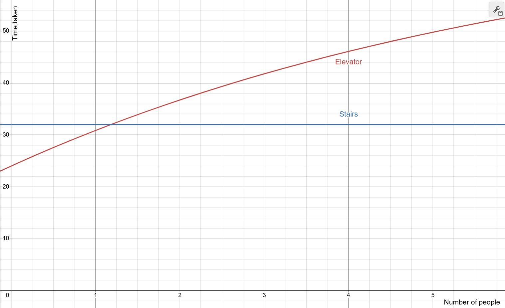
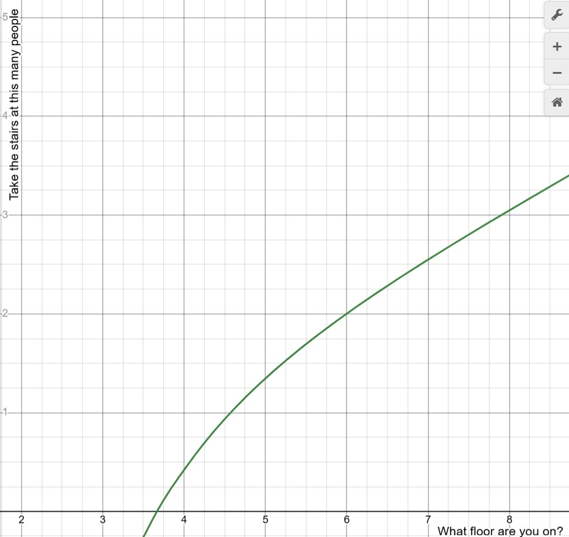

# Should I take the elevator or the stairs?

I live on the 5th floor of my building and one of the two elevators is out of service. This means that when I get back to my building after class, I have two options:
 - Press the elevator button, get into the only working elevator with whoever else is waiting, and wait for my floor to come up. **I can't see what floor the elevator is currently on**. In the best case, the elevator would already be on 1F and I would be alone, letting me ride to 5F quickly. In the worst case, the elevator could take a long time to get to 1F, and then other people would get into the elevator with me and need to go to other floors between 1F and 5F.
 
 - Go to the 1st floor stairs and climb 4 floors. This will always take me the same amount of time. I would prefer this over the elevator, but only if it's faster!

The only thing I really care about in this situation is how fast it takes me to get back to my cozy Marill plushie. 

What should I do?

## Modelling the situation

I can reasonably assume the following:
 - The stairs are never occupied by enough people to slow me down.
 - Everyone in the elevator either wants to go to 1F(and out the building), or from 1F to their room, which will be on a random floor from 2-8.
 - When the 1F elevator button is pressed, the elevator will take some amount of time to get there.
 - Before choosing the elevator or stairs, I'll know the exact number of people that are going with me into the elevator. I'll also know whether the elevator was already at 1F, because it would immediately ring when I press the button.

After briefly timing the situation:
- The elevator takes 24 seconds once it arrives at 1F, plus an additional 16 seconds for every intermediate stop(at 2F, 3F, or 4F).
- The stairs take 32 seconds.
- The elevator can be slower for all manner of uncommon situations[^situations], so if the situation is close the stairs should win.

## Initial thoughts

Accurately finding the amount of time the elevator takes on average to get to 1F before I can get on it will be very difficult. The elevator can be in all manner of states(Going up? Down? Where will it stop before heading towards 1F?) that would require lots of calculations to determine the average time the elevator takes. Instead, we can put this aside and only calculate it if necessary.

Assuming I don't need to wait for the elevator, the time the elevator takes is solely determined by how many stops are required. We can use linearity of expectation[^linearity] to calculate the expected number of stops. The probability of one specific floor not needing to be stopped at for X people is $1 - (\frac{6}{7})^X$ and there are 3 floors between 1F and 5F, so:

$E[stops] = 3 (1 - (\frac67)^X)$

This means that with X people the elevator will take $24 + (16)(3)(1 - (\frac67)^X)$ seconds. Here's how it compares to the stairs:

It looks like I should almost always be taking the stairs. This is the elevator's best-case scenario, when it doesn't need any time to get to 1F, and it's only beating the stairs when there are very few people. As a result, when I reach my building, I should take the stairs if there are 2 or more people. If not, I should still take the stairs if the elevator doesn't immediately arrive, and the elevator if it does. Problem solved!

## What if I was on a different floor?
This changes the number of expected stops(higher floor means more floors between 1F and your floor), how long the elevator takes, and the amount of time required to go through the stairs. I roughly estimated the time for the elevator to be **16 seconds + 2 per floor[^elevatortime] + 16 per stop** and the time taken from stairs to be **8 seconds per floor** and then **+1 for each floor beyond the 3rd**(from legs getting tired), which yields the following.

(Note that we are still assuming the elevator is already at 1F.)
|Floor|Time for stairs|Time for elevator with X people|You should take the elevator...|
|--|--|--|--|
|2F|8s|18s|Never[^convenience]|
|3F|16s|$20 + (16)(1)(1 - (\frac67)^X)$ seconds|Never|
|4F|24s|$22 + (16)(2)(1 - (\frac67)^X)$ seconds|If you're alone|
|5F|33s|$24 + (16)(3)(1 - (\frac67)^X)$ seconds|If there are 1 or fewer others|
|6F|43s|$26 + (16)(4)(1 - (\frac67)^X)$ seconds|If there are 1 or fewer others|
|7F|54s|$28 + (16)(5)(1 - (\frac67)^X)$ seconds|If there are 2 or fewer others|
|8F|66s|$30 + (16)(6)(1 - (\frac67)^X)$ seconds|If there are 3 or fewer others|

## Closing Thoughts

In this problem, I didn't need to estimate how long the elevator would take to get to 1F when I pressed the button, because the elevator was already usually slower. Calculating the elevator wait accurately would depend on the following:
- **Rate of students entering the building**, which would also depend on time of day. This would likely be simulated through a [Poisson process](https://www.geeksforgeeks.org/maths/poisson-processes/).
- **Number of students already waiting**, which combine with the rate of students entering the building to allow an approximation of how long they have been waiting for the elevator. 
- **Rate of students exiting the building**, which influences how often the elevator would be going from high floors to 1F and how often it would be stopping along the way.

This would require setting aside a couple hours to gather information about everyone else living in my building, which is certainly beyond the scope of a convenient problem.

This problem can also be extended in various ways:
- The stair times and willingness also change for those trying to go down, which I did not measure. It's also very fun to jump down many stairs at a time.
- For those that don't like climbing many sets of stairs, adding a "stairs willingness factor"(i.e. I would climb the stairs only if it saves more than X seconds) would also push the needle more towards the elevator.
- The expected wait for an elevator was also easily computable because only one was functioning. With two, the average number of people waiting for an elevator as well as the average wait time decrease and possibly make this a closer call. How much closer?
- It may be worth considering pushing the elevator button and then giving up and taking the stairs after some time to avoid long waits while still being able to capitalize on short ones. This model only waits for immediate elevators already at 1F, but waiting for the possible states that aren't stuck doing something else may be worth it. If so, in what situations would this be optimal?
- If you're in the elevator and someone needs to get off before your floor, it may be worth it to get off at their floor and take the stairs for the remainder. When is this worth it?
- If everyone begins to create their own rule, what kind of equilibrium results from this? 

Elevator traffic analysis is a well established field of engineering, because all higher buildings require efficient elevator systems to function. Rather than evaluate the system from the perspective of an architect, considering what's required to get everyone where they need to be, I judged the system only for myself, finding what would be required to get me where I want to go faster. Despite this, I still ended up re-finding the [probable stops formula](https://liftescalatorlibrary.org/paper_indexing/papers/00000036.pdf#page=2) and considering factors like how fast people arrive and how multiple cars influence the wait. I find it quite interesting how even everyday inconveniences can turn into complex problems when analyzed deeply enough.

At least I only needed to climb 4 flights of stairs and not [59](https://youtu.be/VMmtJl-dCDo). I can hug my plushie for a few more seconds with the time I've saved here.

[^situations]: These situations can include people carrying large objects, people walking very slowly onto the elevator, people accidentally blocking the doorway, the elevator's high weight alarm beeping, and people re-opening the closing door to get in last-second.
[^linearity]: If there are X people and one has to stop at 2F, then a stop at 3F is only required if one of the X-1 remaining people needs to stop there. This is obviously less than the chance of a 3F stop being required out of X people if we didn't have extra information, so the events (1 or more people need to stop at 2F) and (1 or more people need to stop at 3F) are not independent. Linearity of Expectation says that I can ignore this dependence and calculate as though they were independent anyways.
[^elevatortime]: Only 2 seconds per floor looks weird, but most elevators spend significantly more time slowly opening and closing their doors as well as accelerating and decelerating than they do running at top speed. The former is included in the 16 second base instead of in the 2 seconds per floor.
[^convenience]: People obviously take the elevator for one floor all the time, because they would prefer to wait longer to not be tired from climbing stairs. This model purely cares about what gets you to the desired floor fastest.
